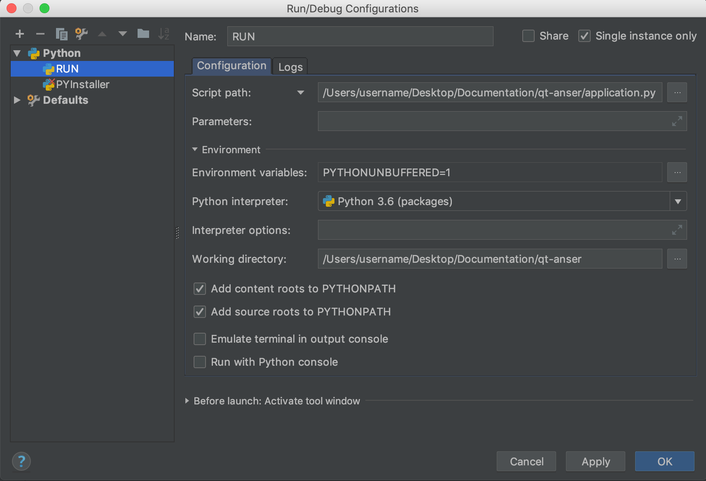
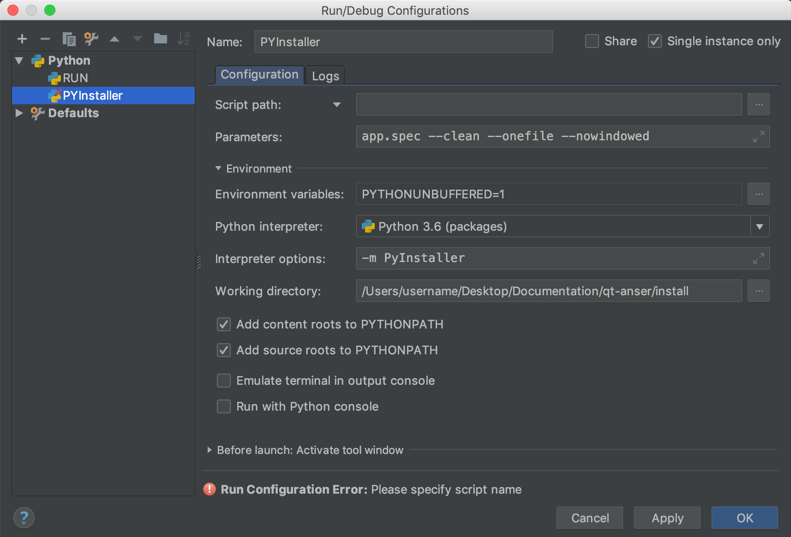

# Qt-Anser

**Qt-Anser** is the graphical user interface (GUI) for the open-source [Anser](https://github.com/AnserEMT/Homepage-Anser.git) electromagnetic tracking system based on the [python-anser](https://github.com/AnserEMT/Python-Anser.git) library.
It is built using the PyQt platform and Pyqtgraph, a graphics tool for 2D/3D (OpenGL) visualisation.

	

## Users

#### Downloads
The application is available on the Windows or MacOS platform and can be downloaded [here](https://github.com/StephenHinds/qt-anser/releases).

#### Manual
A quickstart guide for the Application and Anser EMT system is also available [here](Anser_Manual.pdf).

#### Drivers
The application requires the latest version of **NI DAQmx** (available for [Windows](http://www.ni.com/download/ni-daqmx-17.6/7169/en/) and [MacOS](http://www.ni.com/download/ni-daqmx-base-15.0/5648/en/)). Please refer to the user manual for installation.

## Developers

#### Documentation

The documentation for Qt-Anser is available [here]().

#### Build Instructions

- Qt-Anser is available on Windows and MacOS.
- Setup your **Anaconda Environment** and ensure **Python version** is 3.6.5
- The following packages can be installed using the **pip package manager**:
PyQt5, QDarkStyle, scipy, numpy, numpy-stl, pyqtgraph, pyserial, ruamel.yaml, PyOpenGL, PyDAQmx, pyIGTLink, rx.
- Clone the github repository by typing the following command: `git clone --recursive https://github.com/AnserEMT/Qt-Anser.git`
- To build and run the application install **PyCharm**. Your setup should be as follows:

    

- In order to include the **python-anser** submodule in your project: in your project tree,
    + right click on 'qt-anser' folder and click mark directory as ‘Sources Root’.
    + right click on 'python-anser' folder and click mark directory as ‘Sources Root’.

#### Creating an executable (.exe)

Application packaging freezes or packages the program into a standalone executable `(.exe)` which makes it easier for users to the install application.
**PyInstaller** can be used for this purpose. The `app.spec` file contains the list of instructions to package the application. Your setup should be as follows:

	

## Cite this project
- https://doi.org/10.1007/s11548-017-1568-7
- https://doi.org/10.1007/978-3-030-00937-3_20

## References
This software project uses the following open-source packages
[SciPy](https://www.scipy.org),
[NumPy](https://www.numpy.org),
[PyDAQmx](https://pythonhosted.org/PyDAQmx/),
[PyQt](https://riverbankcomputing.com/software/pyqt/intro),
[PyIGTLink](https://github.com/Danielhiversen/pyIGTLink),
[PyQtGraph](http://www.pyqtgraph.org/),
[Rx](https://github.com/ReactiveX/RxPY),
[QDarkStyle](https://github.com/ColinDuquesnoy/QDarkStyleSheet).

[0]: http://www.ni.com/download/ni-daqmx-17.6/7169/en/
[1]: http://www.ni.com/download/ni-daqmx-base-15.0/5648/en/
[3]: http://www.ni.com/download/ni-daqmx-base-15.0/5644/en/