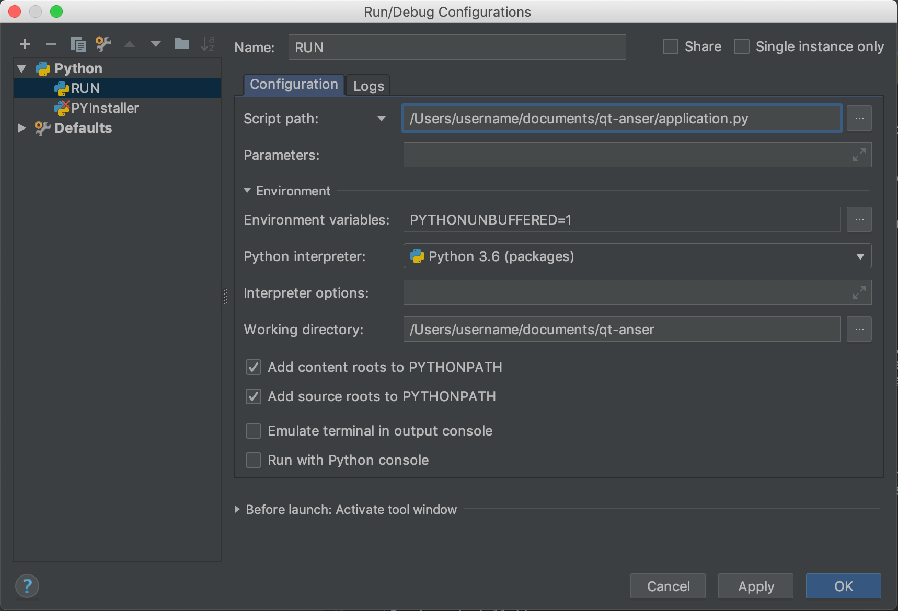
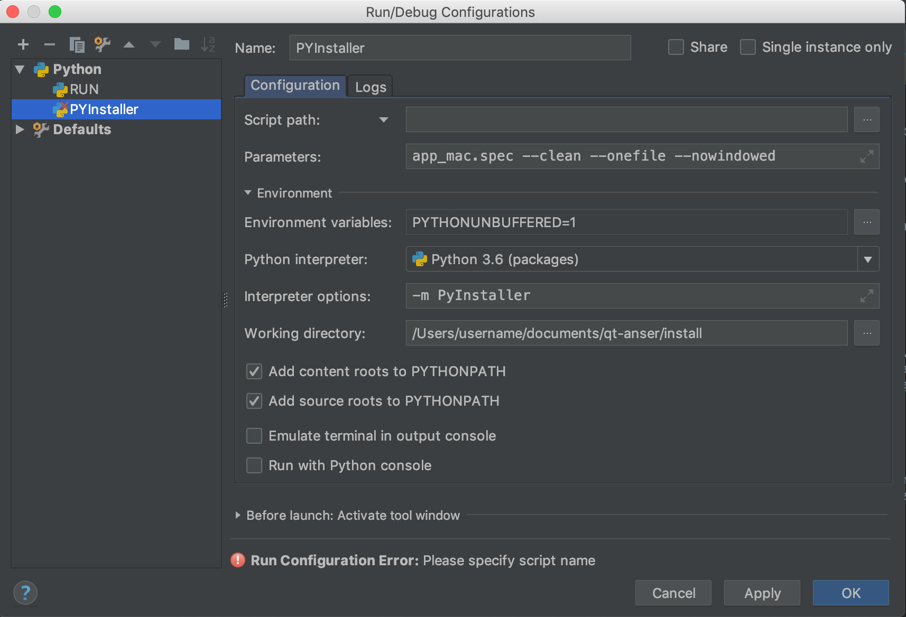

# Qt-Anser

**Qt-Anser** is the graphical user interface (GUI) for the [Anser EMT System](https://github.com/StephenHinds/AnserEMT-Homepage/) based on the [python-anser](https://github.com/AlexJaeger/python-anser) library.
It is built using the PyQt platform and Pyqtgraph a graphics tool for 2D/3D (OpenGL) visualisation.

Go to the [Qt-Anser Homepage ](https://stephenhinds.github.io/qt-anser/) to download the application, 
read the documentation or view system manual.

## Users

#### Downloads
The application is available on the Windows platform and can be downloaded [here]().

#### Manual
A quickstart guide for the Anser EMT system and application is also available [here]() .

#### Drivers
The application requires the latest version of NI DAQmx (available here). Please refer to the user manual for installation.

## Developers

#### Documentation

The documentation for Qt-Anser is available [here]().

#### Build Instructions

- Setup your **Anaconda Environment** and ensure **Python version** is 3.6.5
- The following packages can be installed using the **pip package manager**:
PyQt5, QDarkStyle, scipy, numpy, numpy-stl, pyqtgraph, pyserial, ruamel.yaml, PyOpenGL, PyDAQmx, pyIGTLink, rx.

- To build and run the application install **PyCharm**. Your setup should be as follows:

    

- Also, in order to include the **python-anser** submodule in your project: in your project tree,
	right click on qt-anser folder and click mark directory as ‘Sources Root’
	right click on python-anser folder and mark directory as ‘Sources Root’

#### Creating an executable (.exe)

Application packaging freezes or packages the program into a standalone executable `(.exe)` which makes it easier for users to the install application.
**PyInstaller** can be used for this purpose. The `app.spec` file contains the list of instructions to package the application. Your setup should be as follows:

	

